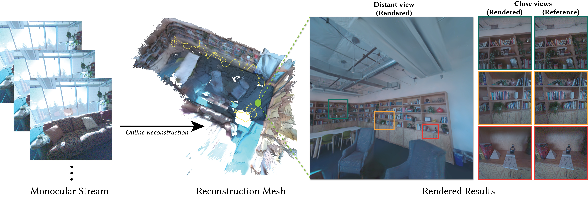

# Monocular Online Reconstruction with Enhanced Detail Preservation

This repository provides a library of the online reconstruction using 3D Gaussians and a tracking system with high-quality details. It is the official implementation of the paper [Monocular Online Reconstruction with Enhanced Detail Preservation](https://poiw.github.io/MODP/index.html) that is published in SIGGRAPH 2025 conference track.



## Environment Setup

> **Note**: The first execution may take additional time as it builds the `gsplats` package.

Run the following script to setup the environment. The codes are only tested on Linux system (Ubuntu and Fedora). There are some known issues on the Windows system so it is recommended using Linux system.

Please also make sure the cuda version matches the cuda used for building pytorch. The code was tested on CUDA 11.8. There are some known issues of building depth-cov under CUDA 12.

```bash
conda create -n MODP python=3.9
conda activate MODP
bash setup_env.sh
```

## Testing

We provide the codes for testing our pipeline on monocular RGB sequences with tracked camera poses and point clouds.

### Running the Pipeline on Datasets

To evaluate the pipeline, run:
```bash
python slam_new.py --config <CONFIG_PATH> --exp_name <EXPERIMENT_NAME>
```

Configuration files are located in the `configs` directory. Ensure that the dataset paths are correctly specified in the chosen configuration file. Change the `dataset_path` in the config file (both under `Dataset` and `Testset`) to the folder storing the data.

**Example**:
```bash
python slam_new.py --config configs/orb_tracking/BuildingX-Focus-Room.yaml --exp_name test
```

Results will be saved under the `./Logs` directory, as defined in the configuration.

## Aria Dataset
The dataset used in the paper can be found here [link](https://www.projectaria.com/async/sample/download/?bucket=core&filename=MODP_Aria_Data_cleaned.zip). It includes RGB image sequences, aria tracking poses, orb tracking poses, and corresponding per frame point clouds. Please download it and modify the path in the config files accordingly.

## Integration with Tracking System

Due to licensing constraints, we are unable to provide the complete tracking system pipeline. For those interested in integration, please refer to the implementation in `utils_new/stream_loader.py` and modify the relevant sections accordingly.

## Acknowledgement
The codes are built upon excellent works from [MonoGS](https://github.com/muskie82/MonoGS), [DepthCov](https://github.com/muskie82/MonoGS), and [gsplats](https://github.com/nerfstudio-project/gsplat). Please consider citing their papers if you found the codes are useful.

## Citation
If you found our codes are useful, please cite our paper

~~~bibtex
@inproceedings{wu2025MODP,
author = {Wu, Songyin and Lv, Zhaoyang and Zhu, Yufeng and Frost, Duncan and Li, Zhengqin and Yan, Ling-Qi and Ren, Carl and Newcombe, Richard and Dong, Zhao},
title = {Monocular Online Reconstruction with Enhanced Detail Preservation},
year = {2025},
publisher = {Association for Computing Machinery},
address = {New York, NY, USA},
url = {https://doi.org/10.1145/3721238.3730659},
doi = {10.1145/3721238.3730659},
booktitle = {Proceedings of the Special Interest Group on Computer Graphics and Interactive Techniques Conference Conference Papers},
articleno = {118},
numpages = {11},
series = {SIGGRAPH Conference Papers '25}
}
~~~

### Contribute

We welcome contributions! Go to [CONTRIBUTING](.github/CONTRIBUTING.md) and our
[CODE OF CONDUCT](.github/CODE_OF_CONDUCT.md) for how to contribute.

## License
This project is licensed by Meta under the Creative Commons Attribution-NonCommercial 4.0 International License ([CC BY-NC 4.0](https://creativecommons.org/licenses/by-nc/4.0/legalcode)), refer to [LICENSE](./LICENSE) file included in this repository for more details.
